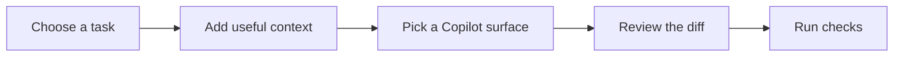

<div align="center">
	<h1>Copilot Academy</h1>
	<p><strong>Learn. Practice. Build with AI.</strong></p>
	<p>A community-built field guide to GitHub Copilot tips, coding workflows, and GH-300 study.</p>
	<p>
		<a href="https://ranjigt.github.io/copilot-academy/"><strong>Open the interactive academy</strong></a>
		&nbsp;·&nbsp;
		<a href="https://docs.github.com/en/copilot">Official Copilot docs</a>
	</p>
	<p>
		
		
		
	</p>
</div>

<p align="center">
	<a href="https://ranjigt.github.io/copilot-academy/">
		
	</a>
</p>

<p align="center"><em>The Copilot Academy overview — open the live guide to explore the interactive version.</em></p>

## Choose your path

| 01 · Find a technique | 02 · Build exam confidence | 03 · Try a scenario |
| --- | --- | --- |
| **Tips & tricks**<br>Prompts, inline coding, tests, debugging, instructions, and agent workflows.<br><br>[Explore practical tips →](https://ranjigt.github.io/copilot-academy/) | **GH-300 study guide**<br>Six objective areas, concise notes, and browser-saved progress.<br><br>[Open the study guide →](https://ranjigt.github.io/copilot-academy/) | **Practice & flashcards**<br>Original scenarios and quick recall. Practice items are not official exam questions.<br><br>[Start practicing →](https://ranjigt.github.io/copilot-academy/) |



> Copilot Academy is an independent community project, not affiliated with or endorsed by GitHub or Microsoft. Feature availability varies by product, plan, and organization policy.

## Workflow cheat sheet

| Goal | Try this | Then verify |
| --- | --- | --- |
| Understand unfamiliar code | “Explain the flow through `@src/path/file.ts`; identify the key functions and cite the relevant files.” | Open the cited code and confirm the explanation matches it. |
| Make a focused change | “Update the parser to accept ISO dates. Preserve the current API and add invalid-input tests.” | Inspect the diff and run the targeted tests. |
| Debug a failure | “Given this error and test output, list likely causes and the smallest check to distinguish them. Don’t edit yet.” | Reproduce the cause with a focused check. |
| Delegate a larger task | “Implement pagination. Keep the response envelope, add boundary tests, and report the checks you ran.” | Review every changed file and run project checks. |
| Review code | “Review this diff for correctness, security, and missing tests. Return actionable findings; don’t rewrite it.” | Confirm findings independently before acting. |

### Context cues

| Cue | Useful for |
| --- | --- |
| `#file` / `@path/to/file` | Grounding a request in a specific file. |
| `#selection` | Focusing on selected code or text. |
| `#changes` | Asking about the current Git diff. |
| `/` | Discovering commands available in the current Copilot chat surface. |

Context markers and slash commands vary by editor and version. Use the current client’s picker and documentation as the source of truth.

## Chat commands

Common VS Code Copilot Chat commands include:

| Command | Typical use |
| --- | --- |
| `/explain` | Ask for an explanation of selected or referenced code. |
| `/fix` | Investigate or propose a fix for a problem. |
| `/tests` | Generate or discuss tests for code. |
| `/clear` | Start a fresh conversation for an unrelated task. |
| `/help` | Discover commands available in the current chat surface. |

Commands are client- and version-dependent. Type `/` in the chat input to see what your installation supports.

## Run locally

Requires Node.js 20.19+ or 22.12+.

```sh
npm install
npm run dev
```

Create a production build with `npm run build`. The generated site is static and can be hosted on GitHub Pages or another static host. The included GitHub Actions workflow deploys pushes to `main`; enable **Settings → Pages → Build and deployment → GitHub Actions** in the repository to publish it.

The interactive library currently starts with 18 practical tips. It is designed to grow as a community reference, not claim to list every Copilot capability. Features and availability change over time and may depend on your editor, plan, or organization settings; verify product behavior against current [GitHub Copilot documentation](https://docs.github.com/en/copilot).

## Quick Reference

<details>
<summary>Open reusable prompt patterns and repository guidance</summary>

These prompt patterns work as starting points. Add the relevant files, code, and project constraints in your Copilot experience, then review and test the result.

### Make a focused change

State the target, behavior, boundary, and verification:

```text
Update the date parser to accept ISO dates. Keep the existing API and add tests for invalid input.
```

For risky changes, ask for a plan before requesting edits:

```text
Inspect the current API and tests. Propose a minimal migration plan; do not edit files yet.
```

### Debug with evidence

Include the exact failure and ask for a way to test the likely cause:

```text
This test fails with the output below. List the two most likely causes and the smallest check to distinguish them. Do not change code yet.
```

### Generate useful tests

Describe behavior and boundaries rather than asking for tests in general:

```text
For this retry helper, test success, a transient failure, the maximum attempt count, and exhausted retries.
```

### Review a diff

Tell Copilot what kind of findings matter and whether it should edit:

```text
Review this diff for correctness, security, and missing tests. Report actionable findings with file and line references; do not rewrite it.
```

### Guide work across a repository

For repeated project conventions, add concise repository instructions (for example, `.github/copilot-instructions.md`). Keep them specific and verify the current instruction-file behavior for your editor.

For agent tasks, make the finish line explicit:

```text
Add pagination to the search endpoint. Preserve the response envelope, add tests for empty and final pages, and report the test command and result.
```

Browse the [full interactive tips library](https://ranjigt.github.io/copilot-academy/) for more examples covering inline suggestions, custom instructions, agent workflows, code review, and maintenance.

</details>

## Copilot Cheat Sheets

<details>
<summary>Open the categorized Copilot topic map and further reading</summary>

These are original quick references for common Copilot workflows. The topic map below reorganizes the breadth of the reference collection around developer tasks instead of reproducing its numbered layout. Feature names, controls, and availability can vary by editor, plan, and organization policy; check official docs before relying on a specific control.

### Topic Map

| Work area | Topics covered |
| --- | --- |
| **Write and communicate** | Copilot request flow and context; Chat; inline completions; next-edit suggestions; inline chat; prompt and context design; smart actions |
| **Shape your workspace** | Repository and path-specific instructions; prompt files; custom agents and modes; skills; MCP connections; hooks; toolsets; customization file layout; Copilot Memory |
| **Coordinate agent work** | GitHub.com workflows; Copilot CLI; Spaces and Spark; third-party agents; browser-based testing; checkpoints and conversation forks; handoffs and parallel sessions; subagents; Copilot app; automations; SDK and Agent Client Protocol; cloud-agent environment; agent apps; CLI plugins, language servers, and remote control; cross-product integrations; spec-first development |
| **Choose models and manage usage** | Model selection; bring-your-own-key options; hosting, retention, and residency; model capabilities and lifecycle; AI-credit costs |
| **Protect code and teams** | Content exclusions; privacy and responsible use; organization and enterprise controls; public-code references and attribution; tool permissions and approvals; security and code-quality features |
| **Review and operate** | Code review; Copilot Autofix; chat and agent debugging; usage-metrics API; adoption dashboards and cohorts |

Use this as a navigation map, not a promise that every feature behaves the same across products. Details that change often—such as model availability, billing, policy scope, and preview status—belong next to current official sources in the interactive guide.

### Choose a Copilot Surface

| Task | A useful starting point |
| --- | --- |
| Complete a small, local piece of code | Inline suggestions; describe intent in nearby code and review the completion before accepting. |
| Ask about selected code or request a focused edit | Chat or inline chat; provide the relevant selection, file, error, and constraints. |
| Explore an unfamiliar repository | Ask for an explanation or investigation first; identify the files and evidence behind the answer. |
| Make a coordinated multi-file change | Agent workflow; define the scope, boundaries, and checks, then inspect every changed file. |
| Run a terminal-centered coding task | Copilot CLI; inspect proposed commands and follow your configured approval controls. |
| Delegate repository work or request a pull-request review | GitHub-hosted Copilot agent or code review; treat the result as a proposal, not an approval. |

### Prompt Recipe

Build a request from five parts:

1. **Goal:** the behavior or outcome you need.
2. **Context:** relevant files, symbols, errors, or examples.
3. **Constraints:** APIs, dependencies, style, or scope to preserve.
4. **Acceptance checks:** tests or observable conditions that define done.
5. **Output:** plan, explanation, patch, or review findings.

Example:

```text
Update the date parser to accept ISO dates. Keep the existing API, add tests for invalid input, and report the test command and result.
```

For broad or risky work, ask for an investigation or plan before authorizing edits. For small work, make one bounded request and iterate from the result.

### Repository Guidance Map

| Artifact | Use it for | Keep in mind |
| --- | --- | --- |
| Repository instructions | Shared conventions and commands that should apply across tasks. | Keep guidance concise, specific, and current. |
| Path-specific instructions | Rules that only apply to a folder or file type. | Check the supported matching syntax and client behavior. |
| Prompt files | Repeatable, user-invoked task templates. | Keep inputs and expected output explicit. |
| Custom agents | A named role with a focused description and bounded tools. | Grant only the tools needed for the role. |
| Agent skills | Reusable procedures, examples, and supporting resources. | Make the trigger, steps, and validation easy to follow. |
| MCP integrations | Connections to external tools or information. | Review provenance, permissions, and data access before enabling. |

These customization mechanisms are not interchangeable, and support differs across VS Code, Copilot CLI, GitHub.com, and other surfaces. See [GitHub Copilot documentation](https://docs.github.com/en/copilot) and [VS Code agent customization](https://code.visualstudio.com/docs/agent-customization/overview) for current details.

### Review Before You Keep

- Read the complete diff, including generated and configuration files.
- Check behavior against the request; do not assume plausible code is correct.
- Run focused tests first, then relevant broader checks.
- Review security, permissions, data handling, and dependency changes.
- Treat review comments and generated tests as suggestions; verify them independently.
- Keep a human decision-maker in the merge and release path.

### Further Reading

The following community collection helped inspire this README format. This project summarizes the topics in its own words and does not reproduce its sheet content:

- [GitHub Copilot cheat sheet](https://github.com/sukurcf/resources/blob/main/cheatsheets/github-copilot-cheatsheet.html)
- [Copilot Chat experience cheat sheet](https://github.com/sukurcf/resources/blob/main/cheatsheets/copilot-chat-experience-cheatsheet.html)
- [GitHub Copilot workflow cheat sheet](https://github.com/sukurcf/resources/blob/main/cheatsheets/github-copilot-workflow-cheatsheet.html)

</details>

## Contributing

Community contributions are welcome. Add focused, original tips that solve a real development task. A useful entry includes:

- A specific title and category.
- The situation where the tip helps.
- A concrete prompt, setting, or code example.
- Why it helps and how to verify the result.
- A link to current official documentation for product-specific behavior, including any editor, plan, or policy requirements.

Do not submit recalled exam questions, exam screenshots, confidential candidate material, or claims that practice questions are official. Keep examples respectful of privacy, security, and responsible AI use.

## Content and trademarks

GitHub Copilot and GH-300 are referenced to describe the subject matter. This community learning resource is independent. Practice questions are original and are not official exam content. Refer to GitHub's public documentation for authoritative product details.
